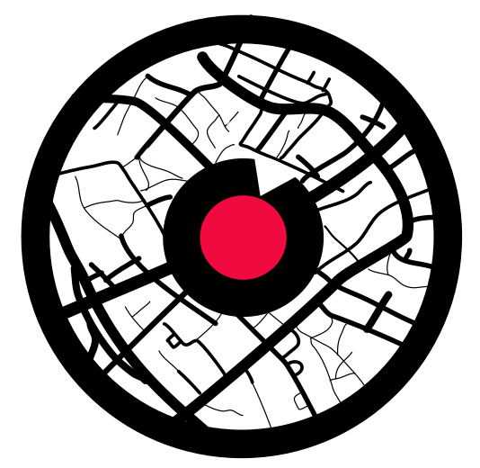

<!-- Improved compatibility of back to top link: See: https://github.com/othneildrew/Best-README-Template/pull/73 -->

<!--
*** Thanks for checking out the Best-README-Template. If you have a suggestion
*** that would make this better, please fork the repo and create a pull request
*** or simply open an issue with the tag "enhancement".
*** Don't forget to give the project a star!
*** Thanks again! Now go create something AMAZING! :D
-->

<!-- PROJECT SHIELDS -->
<!--
*** I'm using markdown "reference style" links for readability.
*** Reference links are enclosed in brackets [ ] instead of parentheses ( ).
*** See the bottom of this document for the declaration of the reference variables
*** for contributors-url, forks-url, etc. This is an optional, concise syntax you may use.
*** https://www.markdownguide.org/basic-syntax/#reference-style-links
-->

<!-- [![Contributors][contributors-shield]][contributors-url]
[![Forks][forks-shield]][forks-url]
[![Stargazers][stars-shield]][stars-url]
[![Issues][issues-shield]][issues-url]
[![MIT License][license-shield]][license-url]
[![LinkedIn][linkedin-shield]][linkedin-url] -->

<!-- PROJECT LOGO -->
 

  

<h3 align="center">Scouter Galactic Admin Portal</h3>

  

    The Admin Portal for controlling the information for the Nightlife, Postmapp, and Emoji app
     
    <a href="http://scouterlive.us-east-1.elasticbeanstalk.com/#/Governance"><strong>Explore the Admin Portal »</strong></a>
     
     
    <!-- <a href="https://github.com/github_username/repo_name">View Demo</a>
    ·
    <a href="https://github.com/github_username/repo_name/issues">Report Bug</a>
    ·
    <a href="https://github.com/github_username/repo_name/issues">Request Feature</a> -->
  

<!-- TABLE OF CONTENTS -->

  
Table of Contents

  <ol>
    <li>
      <a href="#about-the-project">About The Project</a>
      <ul>
        <li><a href="#built-with">Built With</a></li>
      </ul>
    </li>
    <li>
      <a href="#row-operations">Row Operations</a>
      <ul>
        <li><a href="#query-match">Query match</a></li>
        <li><a href="#date-range">Date range</a></li>
        <li><a href="#integer-range">Integer range</a></li>
        <li><a href="#booleans">Booleans</a></li>
        <li><a href="#sort">Sort</a></li>
        <li><a href="#edit">Edit</a></li>
        <li><a href="#sort">Delete</a></li>
      </ul>
    </li>
    <li>
      <a href="#governance">Governance</a>
      <ul>
        <li><a href="#city">City</a>
          <ul>
            <li><a href="#city-glossary">City glossary</a></li>
            <li><a href="#create-city">Create City</a></li>
          </ul>
        </li>
        <li><a href="#comment">Comment</a></li>
        <ul>
            <li><a href="#comment-glossary">Comment glossary</a></li>
            <li><a href="#create-comment">Create Comment</a></li>
          </ul>
        <li><a href="#event">Event</a></li>
          <ul>
            <li><a href="#event-glossary">Event glossary</a></li>
            <li><a href="#create-event">Create Event</a>
            </li>
          </ul>
        <li><a href="#place">Place</a></li>
        <ul>
            <li><a href="#place-glossary">Place glossary</a></li>
            <li><a href="#create-place">Create Place</a>
              <ul>
                <li><a href="#google-place-extraction">Google Place extraction</a></li>
                <li><a href="#manual-insert">Manual Insert</a></li>
              </ul>
            </li>
          </ul>
        <li><a href="#subcomments">SubComments</a>
          <ul>
              <li><a href="#subcomments-glossary">SubComments glossary</a></li>
              <li><a href="#create-subcomment">Create SubComment</a>
              </li>
          </ul>
        </li>
        <li><a href="#users">Users</a>
          <ul>
              <li><a href="#users-glossary">Users glossary</a></li>
              <li><a href="#create-users">Create Users</a>
              </li>
          </ul>
        </li>
        <li><a href="#videos">Videos</a>
          <ul>
                <li><a href="#videos-glossary">Videos glossary</a></li>
                <li><a href="#create-videos">Create Videos</a>
                </li>
          </ul>
        </li>
      </ul>
    </li>
    <li><a href="#enhancers">Enhancers</a></li>
    <ul>
        <li><a href="#event-viewer">Event Viewer</a></li>
        <li><a href="#place-extraction">Place Extraction</a></li>
        <li><a href="#video-batch-editor">Video Batch Editor</a></li>
        <li><a href="#image-batch-editor">Image Batch Editor</a></li>
        <li><a href="#events-extraction">Events Extraction</a></li>
      </ul>
  </ol>

<!-- ABOUT THE PROJECT -->

## About The Project

[![Product Name Screen Shot][product-screenshot]](http://scouterlive.us-east-1.elasticbeanstalk.com/#/Governance)

The Scouter Admin portal allows for interaction with our system. It is divided into two sections:  

<strong>`Governance`</strong> - CRUD operability of the data.  
<strong>`Enhancers`</strong> - Serve the following:

1. `Extracter`: Generating data via a CSV input.
2. `Viewer` : Viewing select data in card format.

<!-- Here's a blank template to get started: To avoid retyping too much info. Do a search and replace with your text editor for the following: `github_username`, `repo_name`, `twitter_handle`, `linkedin_username`, `email_client`, `email`, `project_title`, `project_description` -->

(<a href="#top">back to top</a>)

### Built With

<!-- - [![Next][next.js]][next-url] -->

- [![React][react.js]][react-url]
- [![.NET][.net]][.net-url]
- [![Bootstrap][bootstrap.com]][bootstrap-url]

(<a href="#readme-top">back to top</a>)

---

<!-- ROW OPERATIONS -->

## Row Operations

These are the operations that can be done in the grid view:

### Query match

- Query match will take an input string and match all occurances.  
  [![Query screenshot][query-screenshot]](http://scouterlive.us-east-1.elasticbeanstalk.com/#/Governance)

  
(<a href="#readme-top">back to top</a>)

### Date range

- Date range allows records to be sorted by date.  
  [![Date screenshot][date-screenshot]](http://scouterlive.us-east-1.elasticbeanstalk.com/#/Governance)

  
(<a href="#readme-top">back to top</a>)

### Integer range

- Integer range allows records to be sorted by integers.  
  [![Integer screenshot][integer-screenshot]](http://scouterlive.us-east-1.elasticbeanstalk.com/#/Governance)

  
(<a href="#readme-top">back to top</a>)

### Booleans

- Sort records by booleans.  
  [![Integer screenshot][integer-screenshot]](http://scouterlive.us-east-1.elasticbeanstalk.com/#/Governance)

  
(<a href="#readme-top">back to top</a>)

### Sort

- Sort from A-Z or Z-A.  
  [![Sort screenshot][sort-screenshot]](http://scouterlive.us-east-1.elasticbeanstalk.com/#/Governance)

  
(<a href="#readme-top">back to top</a>)

### Edit

- Under Operation there is an option to edit. This will open the record for `edit view`.  
  [![Edit screenshot][edit-screenshot]](http://scouterlive.us-east-1.elasticbeanstalk.com/#/Governance)

### Delete

- Under Operation there is an option to Delete. This will prompt a confirmation to delete the record  
  [![Edit screenshot][delete-screenshot]](http://scouterlive.us-east-1.elasticbeanstalk.com/#/Governance)

  
(<a href="#readme-top">back to top</a>)

---

<!-- Governance -->

# Governance

The governance section is for CRUD operability of the data.
<a href="http://scouterlive.us-east-1.elasticbeanstalk.com/#/Governance"><strong> Explore live »</strong></a>

(<a href="#readme-top">back to top</a>)

---

<!-- Governance / City -->

## City

<a href="http://scouterlive.us-east-1.elasticbeanstalk.com/#/Governance/City"><strong> View City Governance »

[![Nightlife][nightlife-shield]][nightlife-url]

(<a href="#readme-top">back to top</a>)

---

### City glossary

- <strong><code>CityId(String)</code></strong> - (Autogenerated) - Database ID of city
- <strong><code>CityName(String)</code></strong> - <strong>(Required)</strong> - Name of city
- <strong><code>Country(String)</code></strong> - <strong>(Required)</strong> - ISO Code of Country for city
- <strong><code>Latitude(Integer)</code></strong> - (Optional) - Latitude for city
- <strong>ongitudeitude</code></strong> - (Optional) - Longitude for city
- <strong><code>isScouter(Boolean)</code></strong> - (Optional) - Determines if city is visible in app. Default value is false.
   
  - If True - city is visible.
  - If False - city is not visible
- <strong><code>CityState(String)</code></strong> - (Autogenerated) - State city is linked to.
- <strong><code>CityRanking(Integer)</code></strong> - (Autogenerated) - Ranking of city by population
- <strong><code>Abbreviation(String)</code></strong> - (Autogenerated) - Time zone abbreviation for city
- <strong><code>TimeZone(String)</code></strong> - (Autogenerated) - Timezone city is located in

(<a href="#readme-top">back to top</a>)

---

### Create City

- Click on add. A new screen will pop up  
  [![City screenshot][city-screenshot]](http://scouterlive.us-east-1.elasticbeanstalk.com/#/Governance)
   
  CityName and Country codes (ISO-3166) are required fields. Here is a <a href="https://en.wikipedia.org/wiki/ISO_3166-2"> list of ISO-3166 Codes. </a>
     
  \*\* It is good practice to add the latitude and longitude, although these are not required fields. This will set the center point for the city.

  
(<a href="#readme-top">back to top</a>)

---

<!-- Governance / Comment -->

## Comment

<a href="http://scouterlive.us-east-1.elasticbeanstalk.com/#/Governance/Comment"><strong> View Comment Governance »

[![Nightlife][nightlife-shield]][nightlife-url] [![Postmapp][postmapp-shield]][postmapp-url] ![Emojimapp][emojimapp-shield]

(<a href="#readme-top">back to top</a>)

---

### Comment glossary

- <strong><code>CommentId(String)</code></strong> - (Autogenerated) - Database ID of comment
- <strong><code>PlaceId(String)</code></strong> - <strong>(Optional)</strong> - Linked place to comment
   
  - If PlaceID added:
    - Comment visible in [![Nightlife][nightlife-shield-single]][nightlife-url-single]
    - Placename added to comment in [![Postmapp][postmapp-shield]][postmapp-url]
    - Placename added to comment in ![Emojimapp][emojimapp-shield]
- <strong><code>UserId(String)</code></strong> - (Required) - User linked to comment
- <strong><code>Text(String)</code></strong> - (Required) - Comment text
- <strong><code>Timestamp(Integer)</code></strong> - (Autogenerated) - Timestamp when comment created in Database
- <strong><code>InLocation(Boolean)</code></strong> - (optional) - Comment has been geolocated to the tagged latitude, longitude. Default value Yes.
   
  - If Yes - comment has been geolocated.
  - If No - comment has not been geolocated.
- <strong><code>Like Count(Integer)</code></strong> - (optional) - Number of likes the comment has.
- <strong><code>Dislike Count(Integer)</code></strong> - (optional) - Number of dislikes the comment has.
- <strong><code>CityId(String)</code></strong> - <strong>(Optional)</strong> - Linked City to comment
   
  - If CityID added:
    - Comment visible in [![Nightlife][nightlife-shield-single]][nightlife-url-single] under the live feed.
- <strong><code>VideosId(String)</code></strong> - <strong>(Optional)</strong> - If VideosId is present, this is a comment added for a video.
- <strong><code>ImageUrl(String)</code></strong> - <strong>(Optional)</strong> - If ImageUrl is present, this is a comment with an image attached.
  - If added + `latitude` and `longitude`, image will be visible on the [![Postmapp][postmapp-shield]][postmapp-url]
- <strong><code>Hashtag 1-5(String)</code></strong> - <strong>(Optional)</strong> - Added hashtags (up to 5 maximum) for comment.
   
  - Allows comment to be searchable by hashtag in [![Postmapp][postmapp-shield]][postmapp-url]
  - Allows comment to be searchable by hashtag in ![Emojimapp][emojimapp-shield]
- <strong><code>Emoji(String)</code></strong> - (optional) - Unicode of emoji.
   
  - If added + `latitude, longitude` the emoji will be present on the ![Emojimapp][emojimapp-shield]
- <strong><code>Latitude, Longitude(Integer)</code></strong> - (optional) - Latitude and Longitude points of the comment.
  - If added, thumbnail will be present on the [![Postmapp][postmapp-shield]][postmapp-url]
  - If added + `emoji`, the emoji image will be present on the [![Postmapp][postmapp-shield]][postmapp-url]
- <strong><code>Date(Integer)</code></strong> - (optional) - Added date for the comment.
  - If added, the date will be visible on map thumbnail in [![Postmapp][postmapp-shield]][postmapp-url]
  - Past date posts will not be visible on the [![Postmapp][postmapp-shield]][postmapp-url]
- <strong><code>BatchName(String)</code></strong> - (optional) - Batch that the comment is a part of.
  - If added, this comment will filterable by batches in [![Postmapp][postmapp-shield]][postmapp-url]
- <strong><code>MigratedDate(Integer)</code></strong> - (optional) - Date that the comment was originally posted on outside websites (used with social media scraping).
- <strong><code>MigratedImage(String)</code></strong> - (optional) - URL of the original image source (used with social media scraping).
- <strong><code>Hide(Boolean)</code></strong> - (optional) - Hide comment from all apps.
  - If yes, comment will be hidden from all apps.
  - If no, comment will be visible in all apps.

(<a href="#readme-top">back to top</a>)

---

### Create Comment

- Click on add. A new screen will pop up  
  [![Comment screenshot][comment-screenshot]](http://scouterlive.us-east-1.elasticbeanstalk.com/#/Governance/Comment)
   
  The main points to remember are:

  1. If `CityId` is added, the comment will appear in [![Nightlife][nightlife-shield-single]][nightlife-url-single].
  2. If `PlaceId` is added, the comment will appear under the place feed in [![Nightlife][nightlife-shield-single]][nightlife-url-single]
  3. If `Latitude`, `Longitude`, and `ImageUrl` are added, the comment will appear in the map clusters in [![Postmapp][postmapp-shield]][postmapp-url]
  4. If `Emoji`, `Latitude`, `Longitude` are added, the emoji will be added to the map in ![Emojimapp][emojimapp-shield].
  5. If `BatchName` added, comment will be added to that batch and filterable by batches in [![Postmapp][postmapp-shield]][postmapp-url]

  
(<a href="#readme-top">back to top</a>)

---

<!-- Governance / Event -->

## Event

<a href="http://scouterlive.us-east-1.elasticbeanstalk.com/#/Governance/Event"><strong> View Event Governance »

[![Nightlife][nightlife-shield]][nightlife-url]

(<a href="#readme-top">back to top</a>)

---

### Event glossary

- <strong><code>EventId(String)</code></strong> - (Autogenerated) - Database ID of event.
- <strong><code>CityId(String)</code></strong> - (Optional) - City event is linked under.
  - If present, event will be visible under the event feed for that city.
- <strong><code>PlaceId(String)</code></strong> - (Optional) - Place event is linked under.
  - If present, event will be visible under the event feed for that place.
- <strong><code>EventTitle(String)</code></strong> - (Optional) - Title of the event.
- <strong><code>EventDescription(String)</code></strong> - (Optional) - Description of the event.
- <strong><code>EventImage(String)</code></strong> - (Optional) - URL of the image for the event.
- <strong><code>Timestamp</code></strong> - (Optional) - Date of when the event was generated in our system.
  - If date is a past date, event will not be visible in [![Nightlife][nightlife-shield-single]][nightlife-url-single]
- <strong><code>EventDate</code></strong> - (Required) - Calendar date when the event will take place.
- <strong><code>InstaShortCode</code></strong> - (Optional) - Shortcode of the event on instagram (taken from instagram post).
- <strong><code>Latitude(Integer)</code></strong> - (Optional) - Latitude of the event.
- <strong><code>Longitude(Integer)</code></strong> - (Optional) - Longitude of the event.
- <strong><code>EventStartDate(Integer)</code></strong> - (Optional) - Date and time when the event starts.
- <strong><code>EventEndDate(Integer)</code></strong> - (Optional) - Date and time when the event ends.

(<a href="#readme-top">back to top</a>)

---

### Create Event

- Click on add. A new screen will pop up  
  [![Event screenshot][event-screenshot]](http://scouterlive.us-east-1.elasticbeanstalk.com/#/Governance/Event)
   
  Only `EventDate` is requred, but it is good practice to add the other fields.
   
  `EventImage` can be uploaded by clicking upload, or drag and drop.

  
(<a href="#readme-top">back to top</a>)

---

<!-- Governance / Place -->

## Place

<a href="http://scouterlive.us-east-1.elasticbeanstalk.com/#/Governance/Place"><strong> View Place Governance »

[![Nightlife][nightlife-shield]][nightlife-url]

(<a href="#readme-top">back to top</a>)

---

### Place glossary

- <strong><code>PlaceId(String)</code></strong> - (Autogenerated) - Database ID of place.
- <strong><code>CityId(String)</code></strong> - (Required) - Database ID of City linked to place.
- <strong><code>PlaceName(String)</code></strong> - (Autoextracted) - Name of place
  - If using <a href="#google-place-extraction">Google Place extraction</a>, place name will be extracted
  - If using a manual place insert, place name required
- <strong><code>GooglePlaceName(String)</code></strong> - (Required) - Inputted query to run google place search
  - Best practice should be `PlaceName` + `Address`
  - I.E `Moondogs 3179 Peachtree Rd NE, Atlanta, GA 30305` (This has highest likelihood of matching a google result)
- <strong><code>Country(String)</code></strong> - (Required) - Inputted `country code` to run google place search
  - <a href="https://en.wikipedia.org/wiki/ISO_3166-2"> ISO-3166 input required </a>
- <strong><code>Address(String)</code></strong> - (Autoextracted) - Address of place
  - If using <a href="#google-place-extraction">Google Place extraction</a>, place name will be extracted
  - If using a manual place insert, place name required
- <strong><code>Zip Code(Integer)</code></strong> - (Autoextracted) - Zip code of place
  - If using <a href="#google-place-extraction">Google Place extraction</a>, address will be extracted
  - If using a manual place insert, address required
- <strong><code>Latitude(Integer)</code></strong> - (Autoextracted) - Latitude code of place
  - If using , Latitude will be extracted
  - If using a manual place insert, Latitude required
- <strong><code>Longitude(Integer)</code></strong> - (Autoextracted) - Longitude code of place
  - If using <a href="#google-place-extraction">Google Place extraction</a>, Longitude will be extracted
  - If using a manual place insert, Longitude required
- <strong><code>PlaceType(String)</code></strong> - (Required) - Placetype of place
  - Multiple place types can be passed via comma separated value
  - I.E. `bar,club,bistro` (no spaces between)
- <strong><code>BusyHoursSun(Array)</code></strong> - (Required) - Busy hours of place on Sunday
  - If using <a href="#google-place-extraction">Google Place extraction</a>, busy hours will be extracted.
  - If place does not have busy hours, 0 will be the index value.
  - Indexes are from 0-23; 0 corresponds to 12:00 AM, and 23 corresponds to 11:00 PM
  - Busy Hours range from 0-100.
- <strong><code>BusyHoursMon(Array)</code></strong> - (Required) - Busy hours of place on Monday
  - If using <a href="#google-place-extraction">Google Place extraction</a>, busy hours will be extracted.
  - If place does not have busy hours, 0 will be the index value.
  - Indexes are from 0-23; 0 corresponds to 12:00 AM, and 23 corresponds to 11:00 PM
  - Busy Hours range from 0-100.
- <strong><code>BusyHoursTue(Array)</code></strong> - (Required) - Busy hours of place on Tuesday
  - If using <a href="#google-place-extraction">Google Place extraction</a>, busy hours will be extracted.
  - If place does not have busy hours, 0 will be the index value.
  - Indexes are from 0-23; 0 corresponds to 12:00 AM, and 23 corresponds to 11:00 PM
  - Busy Hours range from 0-100.
- <strong><code>BusyHoursWed(Array)</code></strong> - (Required) - Busy hours of place on Wednesday
  - If using <a href="#google-place-extraction">Google Place extraction</a>, busy hours will be extracted.
  - If place does not have busy hours, 0 will be the index value.
  - Indexes are from 0-23; 0 corresponds to 12:00 AM, and 23 corresponds to 11:00 PM
  - Busy Hours range from 0-100.
- <strong><code>BusyHoursThu(Array)</code></strong> - (Required) - Busy hours of place on Thursday
  - If using <a href="#google-place-extraction">Google Place extraction</a>, busy hours will be extracted.
  - If place does not have busy hours, 0 will be the index value.
  - Indexes are from 0-23; 0 corresponds to 12:00 AM, and 23 corresponds to 11:00 PM
  - Busy Hours range from 0-100.
- <strong><code>BusyHoursFri(Array)</code></strong> - (Required) - Busy hours of place on Friday
  - If using <a href="#google-place-extraction">Google Place extraction</a>, busy hours will be extracted.
  - If place does not have busy hours, 0 will be the index value.
  - Indexes are from 0-23; 0 corresponds to 12:00 AM, and 23 corresponds to 11:00 PM
  - Busy Hours range from 0-100.
- <strong><code>BusyHoursSat(Array)</code></strong> - (Required) - Busy hours of place on Saturday
  - If using <a href="#google-place-extraction">Google Place extraction</a>, busy hours will be extracted.
  - If place does not have busy hours, 0 will be the index value.
  - Indexes are from 0-23; 0 corresponds to 12:00 AM, and 23 corresponds to 11:00 PM
  - Busy Hours range from 0-100.
- <strong><code>RaceWhite(Integer)</code></strong> - (Autogenerated) - White demographic of place
  - If using <a href="#google-place-extraction">Google Place extraction</a>, auto value of `20` will be generated
  - If using a manual place insert, value input required
  - Value represents percentage out of `100%`
  - \*\* Total race percentages should add up to `100%`
- <strong><code>RaceBlack(Integer)</code></strong> - (Autogenerated) - Black demographic of place
  - If using<a href="#google-place-extraction">Google Place extraction</a>, auto value of `20` will be generated
  - If using a manual place insert, value input required
  - Value represents percentage out of `100%`
  - \*\* Total race percentages should add up to `100%`
- <strong><code>RaceAsian(Integer)</code></strong> - (Autogenerated) - Asian demographic of place
  - If using<a href="#google-place-extraction">Google Place extraction</a>, auto value of `20` will be generated
  - If using a manual place insert, value input required
  - Value represents percentage out of `100%`
  - \*\* Total race percentages should add up to `100%`
- <strong><code>RaceLatino(Integer)</code></strong> - (Autogenerated) - Latino demographic of place
  - If using<a href="#google-place-extraction">Google Place extraction</a>, auto value of `20` will be generated
  - If using a manual place insert, value input required
  - Value represents percentage out of `100%`
  - \*\* Total race percentages should add up to `100%`
- <strong><code>RaceIndian(Integer)</code></strong> - (Autogenerated) - Indian demographic of place
  - If using<a href="#google-place-extraction">Google Place extraction</a>, auto value of `20` will be generated
  - If using a manual place insert, value input required
  - Value represents percentage out of `100%`
  - \*\* Total race percentages should add up to `100%`
- <strong><code>GenderMale(Integer)</code></strong> - (Autogenerated) - Male demographic of place
  - If using<a href="#google-place-extraction">Google Place extraction</a>, auto value of `45` will be generated
  - If using a manual place insert, value input required
  - Value represents percentage out of `100%`
  - \*\* Total gender percentages should add up to `100%`
- <strong><code>GenderFemale(Integer)</code></strong> - (Autogenerated) - Female demographic of place
  - If using<a href="#google-place-extraction">Google Place extraction</a>, auto value of `45` will be generated
  - If using a manual place insert, value input required
  - Value represents percentage out of `100%`
  - \*\* Total gender percentages should add up to `100%`
- <strong><code>GenderOther(Integer)</code></strong> - (Autogenerated) - Other demographic of place
  - If using<a href="#google-place-extraction">Google Place extraction</a>, auto value of `10` will be generated
  - If using a manual place insert, value input required
  - Value represents percentage out of `100%`
  - \*\* Total gender percentages should add up to `100%`
- <strong><code>InterestGay(Integer)</code></strong> - (Autogenerated) - Gay demographic of place
  - If using <a href="#google-place-extraction">Google Place extraction</a>, auto value of `15` will be generated
  - If using a manual place insert, value input required
  - Value represents percentage out of `100%`
  - \*\* Total gender percentages should add up to `100%`
- <strong><code>InterestStraight(Integer)</code></strong> - (Autogenerated) - Straight demographic of place
  - If using <a href="#google-place-extraction">Google Place extraction</a>, auto value of `70` will be generated
  - If using a manual place insert, value input required
  - Value represents percentage out of `100%`
  - \*\* Total gender percentages should add up to `100%`
- <strong><code>InterestBisexual(Integer)</code></strong> - (Autogenerated) - Bisexual demographic of place
  - If using <a href="#google-place-extraction">Google Place extraction</a>, auto value of `15` will be generated
  - If using a manual place insert, value input required
  - Value represents percentage out of `100%`
  - \*\* Total gender percentages should add up to `100%`
- <strong><code>PriceRange(String)</code></strong> - (Autoextracted) - Price range of place
  - If using <a href="#google-place-extraction">Google Place extraction</a>, Price range will be extracted
  - If using a manual place insert, price range required
  - Price range are the following:
    - `$` : lowest
    - `$$` : second lowest
    - `$$$` : second highest
    - `$$$` : highest
- <strong><code>Phone Number(String)</code></strong> - (Autoextracted) - Phone number of place
  - If using <a href="#google-place-extraction">Google Place extraction</a>, phone number will be extracted
  - If using a manual place insert, phone number optional.
  - <a href="https://en.wikipedia.org/wiki/List_of_country_calling_codes"> International country codes required </a>
- <strong><code>Rating(Float)</code></strong> - (Autoextracted) - Rating of place
  - If using <a href="#google-place-extraction">Google Place extraction</a>, rating will be extracted
  - If using a manual place insert, rating optional.
  - Rating ranges from `1 - 5`.
- <strong><code>Rating_n(Integer)</code></strong> - (Autoextracted) - number of ratings on place
  - If using <a href="#google-place-extraction">Google Place extraction</a>, rating number will be extracted
  - If using a manual place insert, rating number optional.
- <strong><code>CurrentPopularity(Integer)</code></strong> - (Autoextracted) - Current busy hours
  - If using <a href="#google-place-extraction">Google Place extraction</a>, rating number will be extracted
  - If using a manual place insert, rating number optional.
  - Value will be updated automatically every hour.
- <strong><code>TimeSpent(String)</code></strong> - (Autoextracted) - Average time spent at establishment
  - If using <a href="#google-place-extraction">Google Place extraction</a>, time spent may be extracted.
  - If using a manual place insert, time spent optional.
  - i.e. `60,120` - the values represent number of minutes. `"People generally spent 1 - 2 hours here"`.
- <strong><code>GoogleMapLocation(String)</code></strong> - (Autoextracted) - URL of place google map location
  - If using <a href="#google-place-extraction">Google Place extraction</a>, GoogleMapLocation will be extracted.
  - If using a manual place insert, GoogleMapLocation optional.
- <strong><code>FacebookLink(String)</code></strong> - (Autoextracted) - URL of Facebook Account
  - If using <a href="#google-place-extraction">Google Place extraction</a>, FacebookLink may be extracted.
  - If using a manual place insert, FacebookLink optional.
- <strong><code>TimeZone(String)</code></strong> - (Autoextracted) - Timezone of Place
  - If using <a href="#google-place-extraction">Google Place extraction</a>, TimeZone will be extracted.
  - If using a manual place insert, TimeZone is required.
- <strong><code>Neighborhood(String)</code></strong> - (Autoextracted) - Neighborhood Place resides in.
  - If using <a href="#google-place-extraction">Google Place extraction</a>, Neighborhood will be extracted.
  - If using a manual place insert, Neighborhood is optional.
- <strong><code>InstagramHandle</code></strong> - (Optional) - Instagram account URL.
- <strong><code>InstagramLocation</code></strong> - (Optional) - Instagram location URL.

(<a href="#readme-top">back to top</a>)

---

### Create Place

There exists two methods of creating a place from governance.

- Google Place extraction.
- Manual insert.

#### Google Place extraction

[![Google Place screenshot][place-extraction]](http://scouterlive.us-east-1.elasticbeanstalk.com/#/Governance/Place)
 
Select `CityId` : City that place will be connected to   `Google Place Name`: `place name` + `address`   `Country` : <a href="https://en.wikipedia.org/wiki/ISO_3166-2"> ISO-3166 </a>  
`placeType`: i.e. bar,club,bistro  
`Hard Insert` : Regardless if place has `busy hours`, it will be inserted into database.
  
Click save: The script will automatically extract the rest of the values from google and generate a place.

  
(<a href="#readme-top">back to top</a>)

---

#### Manual Insert

Manual insert allows to manually add a place without running an extraction script.
  
Please unselect `Hide Fields` and follow the <a href="#place-glossary">Place glossary</a> for inputting the values.

---

<!-- Governance / SubComments -->

## SubComments

<a href="http://scouterlive.us-east-1.elasticbeanstalk.com/#/Governance/SubComments"><strong> View Subcomments Governance »

[![Nightlife][nightlife-shield]][nightlife-url] [![Postmapp][postmapp-shield]][postmapp-url] ![Emojimapp][emojimapp-shield]

(<a href="#readme-top">back to top</a>)

---

### SubComments glossary

- <strong><code>SubCommentsId(String)</code></strong> - (Autogenerated) - Database ID of subcomment.
- <strong><code>UserId(String)</code></strong> - (Required) - Database ID of User linked to subcomment.
- <strong><code>CommentId(String)</code></strong> - (Required) - Database ID of parent comment.
- <strong><code>Text(String)</code></strong> - (Required) - Text of subcomment.
- <strong><code>Timestamp(Integer)</code></strong> - (Autogenerated) - Time when subcomment created in database.
- <strong><code>LikeCount(Integer)</code></strong> - (Optional) - Number of likes subcomment has.
- <strong><code>DislikeCount(Integer)</code></strong> - (Optional) - Number of dislikes subcomment has.

(<a href="#readme-top">back to top</a>)

---

### Create SubComment

- Click on add. A new screen will pop up  
  [![Subcomment Screenshot][subcomment-screenshot]](http://scouterlive.us-east-1.elasticbeanstalk.com/#/Governance/SubComments)
   
  Follow the <a href="#subcomments-glossary">SubComments glossary</a> for inputting the values.

  
(<a href="#readme-top">back to top</a>)

---

<!-- Governance / Users -->

## Users

<a href="http://scouterlive.us-east-1.elasticbeanstalk.com/#/Governance/Users"><strong> View Users Governance »

[![Nightlife][nightlife-shield]][nightlife-url] [![Postmapp][postmapp-shield]][postmapp-url] ![Emojimapp][emojimapp-shield]

(<a href="#readme-top">back to top</a>)

---

### Users glossary

- <strong><code>UserId(String)</code></strong> - (Autogenerated) - Database ID of user.
- <strong><code>Name(String)</code></strong> - (Required) - Name of user.
- <strong><code>ProfileImage(String)</code></strong> - (Required) - Profile image url of user.
- <strong><code>Age(Integer)</code></strong> - (Optional) - Age of user.
- <strong><code>Sex(String)</code></strong> - (Optional) - Sex of user. Used in [![Nightlife][nightlife-shield-single]][nightlife-url-single].
- <strong><code>Race(String)</code></strong> - (Optional) - Race of user. Used in [![Nightlife][nightlife-shield-single]][nightlife-url-single].
- <strong><code>Interests(String)</code></strong> - (Optional) - Interests of user. Used in [![Nightlife][nightlife-shield-single]][nightlife-url-single].
- <strong><code>DeviceId(String)</code></strong> - (Autoextracted) - Phone DeviceID of user.
- <strong><code>Latitude(Integer)</code></strong> - (Autoextracted) - Last detected latitude of user device.
- <strong><code>Longitude(Integer)</code></strong> - (Autoextracted) - Last detected longitude of user device.
- <strong><code>CreatedDate(Integer)</code></strong> - (Autogenerated) - Date user was generated in database.
- <strong><code>EmojiFlagUniCode(String)</code></strong> - (Optional) - Unicode of emoji user has selected for flag emoji (`native country`). Used in [![Nightlife][nightlife-shield-single]][nightlife-url-single].
- <strong><code>EmojiPartyAnimalUniCode(String)</code></strong> - (Optional) - Unicode of emoji user has selected for animal emoji (`party animal`). Used in [![Nightlife][nightlife-shield-single]][nightlife-url-single].
- <strong><code>NativePlace(String)</code></strong> - (Required) - Native city user is from. Used in [![Nightlife][nightlife-shield-single]][nightlife-url-single]
- <strong><code>isStatusOpen(Boolean)</code></strong> - (Optional) - If user is open to a hookup. Used in [![Nightlife][nightlife-shield-single]][nightlife-url-single]
  - If `True`, user is `available (yes)`.
  - If `False`, user is `unavailable (no)`.
- <strong><code>UserDescription(String)</code></strong> - (Required) - Short biography of user.
- <strong><code>ModifiedDate(Integer)</code></strong> - (Autogenerated) - Last date user profile was edited.
- <strong><code>userLevel(String)</code></strong> - (Optional) - Level of user.
- <strong><code>CountryCode(Integer)</code></strong> - (Autoextracted) - Country code of user's phone number.
- <strong><code>Phone(Integer)</code></strong> - (Autoextracted) - User's phone number.
- <strong><code>FullName(String)</code></strong> - (Optional) - User's full name.
- <strong><code>Email(String)</code></strong> - (Optional) - User's email address.
- <strong><code>DateofBirth(Integer)</code></strong> - (Optional) - User's date of birth.
- <strong><code>isArchived(Boolean)</code></strong> - (Optional) - If user is archived.
- <strong><code>BatchName(String)</code></strong> - (Optional) - Name of batch user is linked to.
- <strong><code>DeviceIdentifier(String)</code></strong> - (Autogenerated) - Unique device identifier generated upon installing mobile app.
- <strong><code>InstagramBusiness(Boolean)</code></strong> - (Autoextracted) - If user scraped from Instagram is a registered business.
- <strong><code>InstagramVerified(Boolean)</code></strong> - (Autoextracted) - If user scraped from Instagram is verified.
- <strong><code>InstagramFollowercount(Integer)</code></strong> - (Autoextracted) - Number of follower user scraped from Instagram has.
- <strong><code>InstagramFollowingcount(Integer)</code></strong> - (Autoextracted) - Number of following user scraped from Instagram has.
- <strong><code>MediaCount(Integer)</code></strong> - (Autoextracted) - Number of posts user scraped from Instagram has uploaded to Instagram.

(<a href="#readme-top">back to top</a>)

---

### Create Users

- Click on add. A new screen will pop up  
  [![Users Screenshot][users-screenshot]](http://scouterlive.us-east-1.elasticbeanstalk.com/#/Governance/Users)
   
  Required fields (Example Object):  
  `Name`: `JustinJackson24`  
  `Age`: `24`  
  `Latitude`: `37.425`  
  `Longitude`: `-81.476`  
  `NativePlace`: `Atlanta`  
  `UserDescription`: `I Love to go hiking and fishing`  
  `ProfileImage`: Uploaded Image

  Follow the <a href="#users-glossary">Users glossary</a> for the remaining optional fields.

  
(<a href="#readme-top">back to top</a>)

---

<!-- Governance / Videos -->

## Videos

<a href="http://scouterlive.us-east-1.elasticbeanstalk.com/#/Governance/Videos"><strong> View Comment Governance »

[![Nightlife][nightlife-shield]][nightlife-url] [![Postmapp][postmapp-shield]][postmapp-url] ![Emojimapp][emojimapp-shield]

(<a href="#readme-top">back to top</a>)

---

### Videos glossary

- <strong><code>VideosId(String)</code></strong> - (Autogenerated) - Database ID of video.
- <strong><code>UserId(String)</code></strong> - (Required) - User linked to video.
- <strong><code>PlaceId(String)</code></strong> - <strong>(Optional)</strong> - Linked place to video.
   
  - If PlaceID added:
    - Comment visible in [![Nightlife][nightlife-shield-single]][nightlife-url-single]
    - Placename added to comment in [![Postmapp][postmapp-shield]][postmapp-url]
    - Placename added to comment in ![Emojimapp][emojimapp-shield]
- <strong><code>ThumbnailUrl(String)</code></strong> - <strong>(Autogenerated, Required)</strong> - Thumbnail image URL.
  - If added + `latitude` and `longitude`, image will be visible on the [![Postmapp][postmapp-shield]][postmapp-url]
- <strong><code>Timestamp(Integer)</code></strong> - (Autogenerated) - Timestamp when video was created in Database.
- <strong><code>VideoUrl(Integer)</code></strong> - <strong>(Autogenerated, Required)</strong> - Uploaded video URL.
- <strong><code>IsLocation(Boolean)</code></strong> - (optional) - Video has been geolocated to the tagged latitude, longitude. Default value Yes.
   
  - If True - video has been geolocated.
  - If False - video has not been geolocated.
- <strong><code>CityId(String)</code></strong> - <strong>(Optional)</strong> - Linked City to comment
   
  - If CityID added:
    - Video visible in [![Nightlife][nightlife-shield-single]][nightlife-url-single] under the live feed.
- <strong><code>ViewCount(Integer)</code></strong> - (Required) - Number of views the video has.
- <strong><code>VideoDescription(String)</code></strong> - (Required) - Video's description.
- <strong><code>TagLocation(Boolean)</code></strong> - (Optional) - If video has been tagged to a place in database.
- <strong><code>LikeCount(Integer)</code></strong> - (Optional) - Number of likes the video has.
- <strong><code>DislikeCount(Integer)</code></strong> - (Optional) - Number of dislikes the video has.
- <strong><code>Hashtag 1-5(String)</code></strong> - <strong>(Optional)</strong> - Added hashtags (up to 5 maximum) for comment.
   
  - Allows comment to be searchable by hashtag in [![Postmapp][postmapp-shield]][postmapp-url]
  - Allows comment to be searchable by hashtag in ![Emojimapp][emojimapp-shield]
- <strong><code>Emoji</code></strong> - (optional) - Unicode of emoji.
   
  - If added + `latitude, longitude` the emoji will be present on the ![Emojimapp][emojimapp-shield]
- <strong><code>Latitude, Longitude(Integer)</code></strong> - (optional) - Latitude and Longitude points of the video.
  - If added, thumbnail will be present on the [![Postmapp][postmapp-shield]][postmapp-url]
  - If added + `emoji`, the emoji image will be present on the [![Postmapp][postmapp-shield]][postmapp-url]
- <strong><code>BatchName(String)</code></strong> - (optional) - Batch that the comment is a part of.
  - If added, this comment will filterable by batches in [![Postmapp][postmapp-shield]][postmapp-url]
- <strong><code>Date(Integer)</code></strong> - (Optional) - Will be visible on map thumbnail in [![Postmapp][postmapp-shield]][postmapp-url]
  - Past date posts will not be visible on the [![Postmapp][postmapp-shield]][postmapp-url]
- <strong><code>MigratedDate(Integer)</code></strong> - (optional) - Date that the video was originally posted on outside websites (used with social media scraping).
- <strong><code>MigratedVideoUrl(String)</code></strong> - (optional) - URL of the original video source (used with social media scraping).
- <strong><code>Hide(Boolean)</code></strong> - (optional) - Hide comment from all apps.
  - If True, video will be hidden from all apps.
  - If False, video will be visible in all apps.

(<a href="#readme-top">back to top</a>)

---

### Create Videos

- Click on add. A new screen will pop up  
  [![Video screenshot][video-screenshot]](http://scouterlive.us-east-1.elasticbeanstalk.com/#/Governance/Videos)
   
  Required fields (Example Object):  
  `UserId`: `Jboosie24`  
  `ViewCount`: `124`  
  `VideoDescription`: `This is an awesome place`  
  `VideoURL`: Uploaded Video  
  `LikeCount`: `100`  
  `DislikeCount`: `30`
    
  [![Nightlife][nightlife-shield-single]][nightlife-url-single] live feed: Add `CityId`  
  [![Nightlife][nightlife-shield-single]][nightlife-url-single] place feed: Add `CityId`, `PlaceId`  
  [![Postmapp][postmapp-shield]][postmapp-url] Map (required): `Latitude`, `Longitude`, `ThumbnailUrl`  
  [![Postmapp][postmapp-shield]][postmapp-url] Batches (required): `Latitude`, `Longitude`, `BatchName`, `ThumbnailUrl`  
  [![Postmapp][postmapp-shield]][postmapp-url] Hashtag search (required): `Latitude`, `Longitude`, `BatchName`, `Hashtag1-5`, `ThumbnailUrl`  
  ![Emojimapp][emojimapp-shield] Map (required): `Latitude`, `Longitude`, `Emoji`  
  ![Emojimapp][emojimapp-shield] Hashtag Search (required): `Latitude`, `Longitude`, `Emoji`, `Hashtag1-5`  

  Follow the <a href="#videos-glossary">Videos glossary</a> for the remaining optional fields.

    
(<a href="#readme-top">back to top</a>)

---

<!-- Enhancers -->

# Enhancers

The governance section is for CRUD operability of the data.
<a href="http://scouterlive.us-east-1.elasticbeanstalk.com/#/Events"><strong> Explore live »</strong></a>

<strong>`Enhancers`</strong> - Serve the following:

1. `Extracter`: Generating data via a CSV input.
2. `Viewer` : Viewing select data in card format.

(<a href="#readme-top">back to top</a>)

---

<!-- Enhancers / Event Viewer -->

## Event Viewer

<a href="http://scouterlive.us-east-1.elasticbeanstalk.com/#/Events/ScouterEvent"><strong> View Event Viewer »

[![Nightlife][nightlife-shield]][nightlife-url]

The Event Viewer displays event records in card view. It allows only for `deletion` of records.
 
[![Event Viewer screenshot][event-viewer]](http://scouterlive.us-east-1.elasticbeanstalk.com/#/Events/ScouterEvent)

(<a href="#readme-top">back to top</a>)

---

<!-- Enhancers / Place Extraction -->

## Place Extraction

<a href="http://scouterlive.us-east-1.elasticbeanstalk.com/#/Events/CsvPlaceexrac"><strong> Place Extraction »

[![Nightlife][nightlife-shield]][nightlife-url]

The Place extraction enhancers will run the <a href="#google-place-extraction">Google Place extraction</a> script on a entire `CSV list` of places.

[![Place extraction input screenshot][place-extraction-input]](http://scouterlive.us-east-1.elasticbeanstalk.com/#/Events/ScouterEvent)

1. A `CSV Places` input will be attached [Sample Places CSV](./places-sample.csv):  

2. A `CSV Proxies` input will be attached. The proxies can be fetched from <a href="http://list.didsoft.com/get?email=rajeshkumardevapp@gmail.com&pass=zxamw8&pid=http1000&showcountry=no&level=1"> Level 1 </a> or <a href="http://list.didsoft.com/get?email=rajeshkumardevapp@gmail.com&pass=zxamw8&pid=http1000&showcountry=no&level=2"> Level 2 </a>. The proxy list refreshes `every 30 minutes` [Sample Proxy CSV](./proxy-sample.csv)
    
3. Input the <a href="https://en.wikipedia.org/wiki/ISO_3166-2"> Country ISO-3166 Code </a>  
4. Select the city   
   The process is now ready to run. The places are prepped and ready to be extracted. 
   [![Places ready screenshot][place-extraction-ready]](http://scouterlive.us-east-1.elasticbeanstalk.com/#/Events/CsvPlaceexrac)   
5. Start the process.   
   The places have been successfully extracted and inserted into the database! 
   [![Places extracted screenshot][places-successfully-extracted]](http://scouterlive.us-east-1.elasticbeanstalk.com/#/Events/CsvPlaceexrac)   
6. Notes:  

- The `BatchName` will automatically be generated and titled with `date` batch was ran.
- Any other message besides `Success` means the place was `unsuccessfully inserted`.
- The batch `error log` can be downloaded.
- If the process is stuck on `message:loading` more than 30 seconds, repeat `steps 2-5`.

 

(<a href="#readme-top">back to top</a>)

---

<!-- Enhancers / Video Viewer -->

## Video Batch Editor

<a href="http://scouterlive.us-east-1.elasticbeanstalk.com/#/Events/VideoEditor"><strong> View Video Batch Editor »

[![Postmapp][postmapp-shield]][postmapp-url]   

The Video batch editor allows for CRUD operability of Video `batches`, and presents videos in a card viewer.

[![Video Batch Editor Screenshot][video-batch-editor]](http://scouterlive.us-east-1.elasticbeanstalk.com/#/Events/VideoEditor)   
The following operations are available starting from the top left:  

1. `Select batch` - loads a selected batch.
2. `Refresh` - refresh the batch page - often used once deleting or adding to the batch to refresh data.
3. `Delete Selected` - when selecting a video allows selected videos to be deleted.
4. `Add video to batch` - add a video to this selected batch.
5. `Delete Batch` - delete entire batch.
6. `Remove duplicates for this batch` - removes duplicate videos from the batch.
7. `Batch Hidden` - a toggle to publish the batch live or hide the batch from the `batch screen`.   

Note: The numbers below the video are the `latitude and longitude` the video is attached to.

(<a href="#readme-top">back to top</a>)

---

<!-- Enhancers / Image Viewer -->

## Image Batch Editor

<a href="http://scouterlive.us-east-1.elasticbeanstalk.com/#/Events/CommentEditor"><strong> View Comment Batch Editor »

[![Postmapp][postmapp-shield]][postmapp-url]   

The Image batch editor allows for CRUD operability of image `batches`, and presents images in a card viewer.

[![Image Batch Editor Screenshot][image-batch-editor]](http://scouterlive.us-east-1.elasticbeanstalk.com/#/Events/CommentEditor)   
The following operations are available starting from the top left:  

1. `Select batch` - loads a selected batch.
2. `Refresh` - refresh the batch page - often used once deleting or adding to the batch to refresh data.
3. `Delete Selected` - when selecting a video allows selected videos to be deleted.
4. `Add comment to batch` - add an image to this selected batch.
5. `Delete Batch` - delete entire batch.
6. `Batch Hidden` - a toggle to publish the batch live or hide the batch from the `batch screen`.   

Note: The numbers below the image are the `latitude and longitude` the video is attached to.

(<a href="#readme-top">back to top</a>)

---

<!-- Enhancers / Events Extraction -->

## Events Extraction

<a href="http://scouterlive.us-east-1.elasticbeanstalk.com/#/Events/EventsUploader"><strong> Event Extraction »

[![Nightlife][nightlife-shield]][nightlife-url]

The Events extraction enhancers take a `CSV input` of events, and will extract and generate events in the database for each row.

[![Event extraction input screenshot][event-extraction]](http://scouterlive.us-east-1.elasticbeanstalk.com/#/Events/EventsUploader)   

1. A `CSV Event` input will be attached. [Sample Event CSV](./event-extract.csv):  
2. A `Places with PlaceID` input will be attached. [Sample Places with PlaceID CSV](./places-placeid.csv):  

- Notes:  
  - `Placenames` should `exactly match` the placename in `CSV Event` input. If they do not, the events will not be linked to the correct places  
  - Places must be first inserted to return `PlaceId`. This can be done through <a href="#google-place-extraction">Google Place extraction</a> or <a href="#place-extraction">CSV Place Extraction</a>  

3. Click `Submit with available keys`. Click <strong>Only one time!</strong> 

- Notes:  
  - If any placenames are empty and/or do not match, those events `will not be inserted`

(<a href="#readme-top">back to top</a>)

<!-- ## Usage

Use this space to show useful examples of how a project can be used. Additional screenshots, code examples and demos work well in this space. You may also link to more resources.

_For more examples, please refer to the [Documentation](https://example.com)_

(<a href="#readme-top">back to top</a>)
 -->

<!-- ROADMAP -->

<!-- ## Roadmap -->

<!-- - [ ] Feature 1
- [ ] Feature 2
- [ ] Feature 3
  - [ ] Nested Feature

See the [open issues](https://github.com/github_username/repo_name/issues) for a full list of proposed features (and known issues). -->

<!-- 
(<a href="#readme-top">back to top</a>)
 -->

<!-- CONTRIBUTING -->

<!-- ## Contributing

Contributions are what make the open source community such an amazing place to learn, inspire, and create. Any contributions you make are **greatly appreciated**.

If you have a suggestion that would make this better, please fork the repo and create a pull request. You can also simply open an issue with the tag "enhancement".
Don't forget to give the project a star! Thanks again!

1. Fork the Project
2. Create your Feature Branch (`git checkout -b feature/AmazingFeature`)
3. Commit your Changes (`git commit -m 'Add some AmazingFeature'`)
4. Push to the Branch (`git push origin feature/AmazingFeature`)
5. Open a Pull Request

(<a href="#readme-top">back to top</a>)
 -->

<!-- LICENSE -->

<!-- ## License

Distributed under the MIT License. See `LICENSE.txt` for more information.

(<a href="#readme-top">back to top</a>)
 -->

<!-- CONTACT -->

<!-- ## Contact

Your Name - [@twitter_handle](https://twitter.com/twitter_handle) - email@email_client.com

Project Link: [https://github.com/github_username/repo_name](https://github.com/github_username/repo_name)

(<a href="#readme-top">back to top</a>)
 -->

<!-- ACKNOWLEDGMENTS -->

<!-- ## Acknowledgments

- 
- 
- 

(<a href="#readme-top">back to top</a>)
 -->

<!-- MARKDOWN LINKS & IMAGES -->
<!-- https://www.markdownguide.org/basic-syntax/#reference-style-links -->

[place-file]: places-sample.csv
[contributors-shield]: https://img.shields.io/github/contributors/github_username/repo_name.svg?style=for-the-badge
[contributors-url]: https://github.com/github_username/repo_name/graphs/contributors
[forks-shield]: https://img.shields.io/github/forks/github_username/repo_name.svg?style=for-the-badge
[forks-url]: https://github.com/github_username/repo_name/network/members
[stars-shield]: https://img.shields.io/github/stars/github_username/repo_name.svg?style=for-the-badge
[stars-url]: https://github.com/github_username/repo_name/stargazers
[issues-shield]: https://img.shields.io/github/issues/github_username/repo_name.svg?style=for-the-badge
[issues-url]: https://github.com/github_username/repo_name/issues
[license-shield]: https://img.shields.io/github/license/github_username/repo_name.svg?style=for-the-badge
[license-url]: https://github.com/github_username/repo_name/blob/master/LICENSE.txt
[linkedin-shield]: https://img.shields.io/badge/-LinkedIn-black.svg?style=for-the-badge&logo=linkedin&colorB=555
[linkedin-url]: https://linkedin.com/in/linkedin_username
[nightlife-shield]: https://img.shields.io/badge/Apps-Nightlife-ff0000
[nightlife-url]: https://apps.apple.com/us/app/scouter-nightlife/id1491606876
[postmapp-shield]: https://img.shields.io/badge/-Postmapp-yellowgreen
[postmapp-url]: https://apps.apple.com/us/app/postmapp/id1604339031
[nightlife-shield-single]: https://img.shields.io/badge/-Nightlife-ff0000
[nightlife-url-single]: https://apps.apple.com/us/app/scouter-nightlife/id1491606876
[emojimapp-shield]: https://img.shields.io/badge/-Emojimapp-ff69b4
[required-shield]: https://img.shields.io/badge/-required-green
[product-screenshot]: images/screenshot.png
[query-screenshot]: images/query-screenshot.png
[proxy-csv-input]: images/proxy-csv.png
[place-csv]: images/place-csv.png
[date-screenshot]: images/date-range.png
[integer-screenshot]: images/integer-screenshot.png
[sort-screenshot]: images/sort-screenshot.png
[edit-screenshot]: images/edit-screenshot.png
[delete-screenshot]: images/delete-screenshot.png
[city-screenshot]: images/city-create.png
[event-screenshot]: images/event-create.png
[event-viewer]: images/event-viewer.png
[comment-screenshot]: images/comment-create.png
[subcomment-screenshot]: images/create-subcomment.png
[users-screenshot]: images/users-create.png
[video-screenshot]: images/create-video.png
[video-batch-editor]: images/video-batch-editor.png
[image-batch-editor]: images/image-batch-editor.png
[event-extraction]: images/event-extraction.png
[place-extraction]: images/place-extraction.png
[place-extraction-input]: images/place-extraction-input.png
[place-extraction-ready]: images/place-extraction-ready.png
[places-successfully-extracted]: images/places-successfully-extracted.png
[.net]: https://img.shields.io/badge/.NET-5C2D91?style=for-the-badge&logo=.net&logoColor=white
[.net-url]: https://dotnet.microsoft.com/en-us/
[next.js]: https://img.shields.io/badge/next.js-000000?style=for-the-badge&logo=nextdotjs&logoColor=white
[next-url]: https://nextjs.org/
[react.js]: https://img.shields.io/badge/React-20232A?style=for-the-badge&logo=react&logoColor=61DAFB
[react-url]: https://reactjs.org/
[vue.js]: https://img.shields.io/badge/Vue.js-35495E?style=for-the-badge&logo=vuedotjs&logoColor=4FC08D
[vue-url]: https://vuejs.org/
[angular.io]: https://img.shields.io/badge/Angular-DD0031?style=for-the-badge&logo=angular&logoColor=white
[angular-url]: https://angular.io/
[svelte.dev]: https://img.shields.io/badge/Svelte-4A4A55?style=for-the-badge&logo=svelte&logoColor=FF3E00
[svelte-url]: https://svelte.dev/
[laravel.com]: https://img.shields.io/badge/Laravel-FF2D20?style=for-the-badge&logo=laravel&logoColor=white
[laravel-url]: https://laravel.com
[bootstrap.com]: https://img.shields.io/badge/Bootstrap-563D7C?style=for-the-badge&logo=bootstrap&logoColor=white
[bootstrap-url]: https://getbootstrap.com
[jquery.com]: https://img.shields.io/badge/jQuery-0769AD?style=for-the-badge&logo=jquery&logoColor=white
[jquery-url]: https://jquery.com
